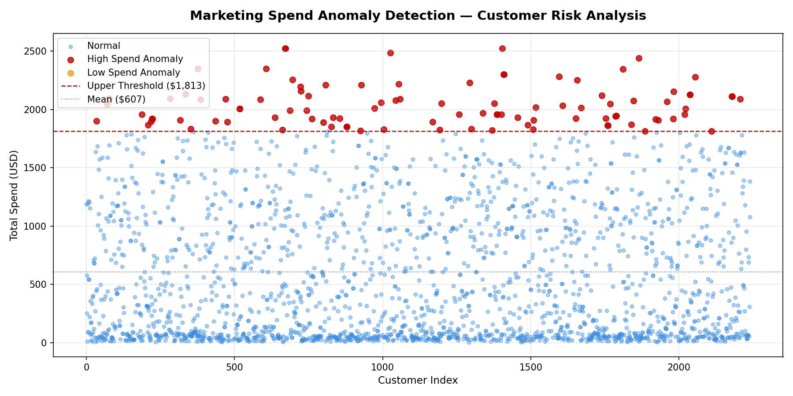

# Marketing Spend Anomaly Detection — Python

## Business question
Which customers represent statistical spending outliers that
warrant further investigation from a risk and targeting perspective?

## Dataset
Marketing Campaign Dataset — 2,240 customer records including
spend across 6 product categories, campaign responses, and
demographic data (public domain).

## Methodology
Applied mean ± 2 standard deviations threshold — an
industry-standard statistical method used in audit analytics
to flag unusual patterns without requiring machine learning.

- Calculated Total Spend per customer across 6 categories:
  Wines, Fruits, Meat, Fish, Sweet Products, Gold Products
- Upper threshold: Mean + 2×SD = $1,813
- Customers above threshold flagged as High Spend Anomalies
- Risk Score = (spend − mean) / standard deviation

## Key findings
- Mean customer spend: $607
- Anomaly threshold: $1,813
- High Spend Anomalies flagged: 99 customers (4.4% of total)
- Top anomalous customer spent 4.2× above the mean ($2,525 vs $607)
- High spenders concentrated in Wines ($1,156) and Meat ($915) categories
- 2,117 customers (94.5%) classified as normal spend behaviour

## Output files
- `anomaly_chart.png` — scatter plot with flagged anomalies
- `top_anomalies.csv` — top 10 highest risk customers

## Tools used
Python 3 · pandas · matplotlib

## How to run
pip install pandas matplotlib
python anomaly_detection.py

## Anomaly chart

